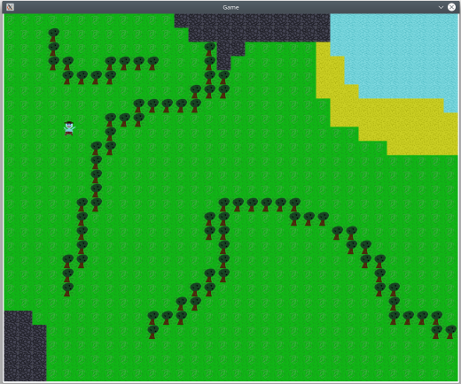

# Game2D

Using [SFML](https://www.sfml-dev.org) for developing a simple game.




## Build
```
mkdir -p build && cd build
cmake ..
make
```

## Dependencies

- SFML 2.x
- C++ compiler
- CMake

### Installing using apt
```
sudo apt install libsfml-dev
sudo apt install cmake
```

### Tested with
```
Kubuntu 18.04

SFML 2.5.1
Clang++ 10.1, GCC 7.5.0
CMake 3.17.1
```